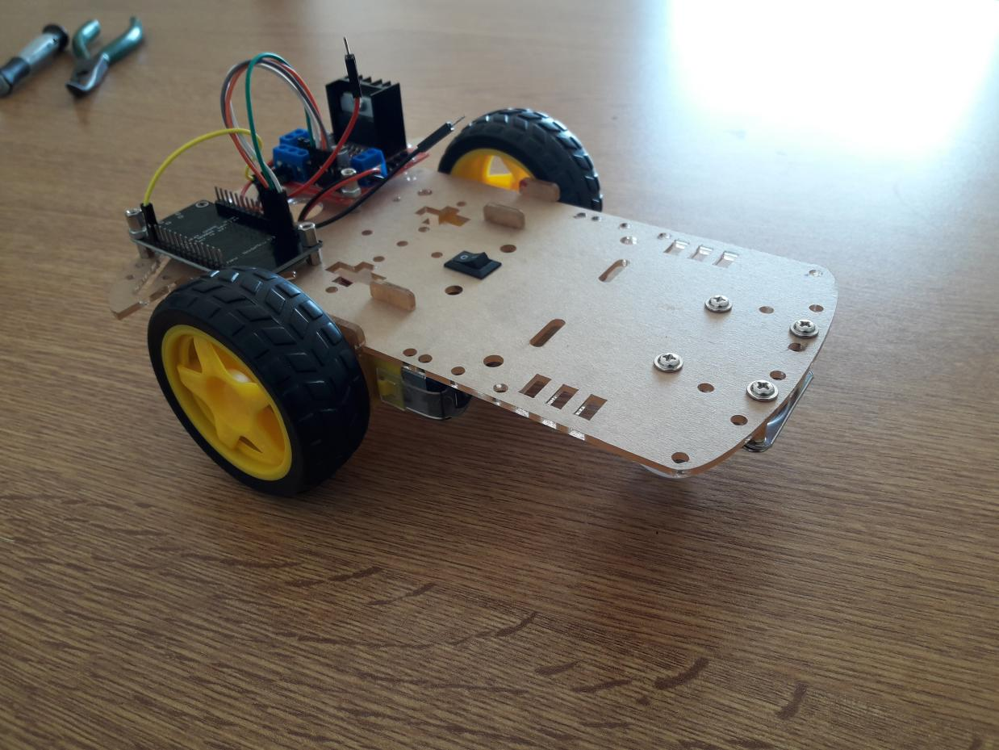

# Control de robot Wi-Fi con Eyetracker Tobii

### Materiales

  - NodeMCU Amica v3.
  - L298n Dual Full-Bridge. 
  - Kit Chasis Robot 3 Ruedas.
  - Tobii Eyetracker.
  - Tobii EyeX SDK.
  - Android Smartphone con cualquier app de cámara IP.

### Tobii EyeX Web Socket Server

El autor del Web Socket Server para el Eyetracker Tobii es Stevche Radevski:

https://github.com/sradevski/Tobii-EyeX-Web-Socket-Server

### TODO

- [x] Control de rover mediante Web Socket.
- [x] Control de rover con mouse desde el navegador.
- [ ] Control de rover con eyetracker desde navegador.
- [ ] Conexión automática al rover y camera ip.

## Licencia

Este proyecto está publicado bajo licencia GPL V3.0.