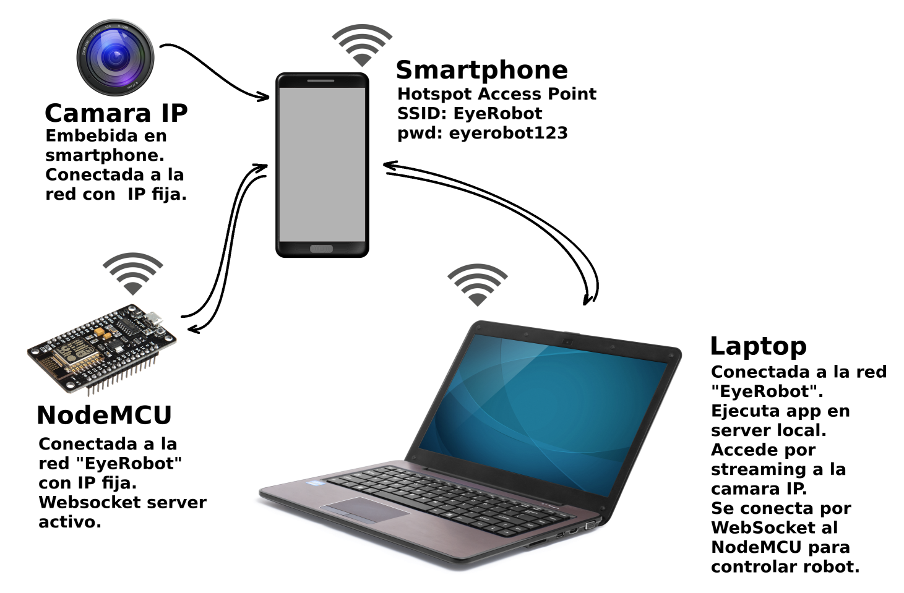
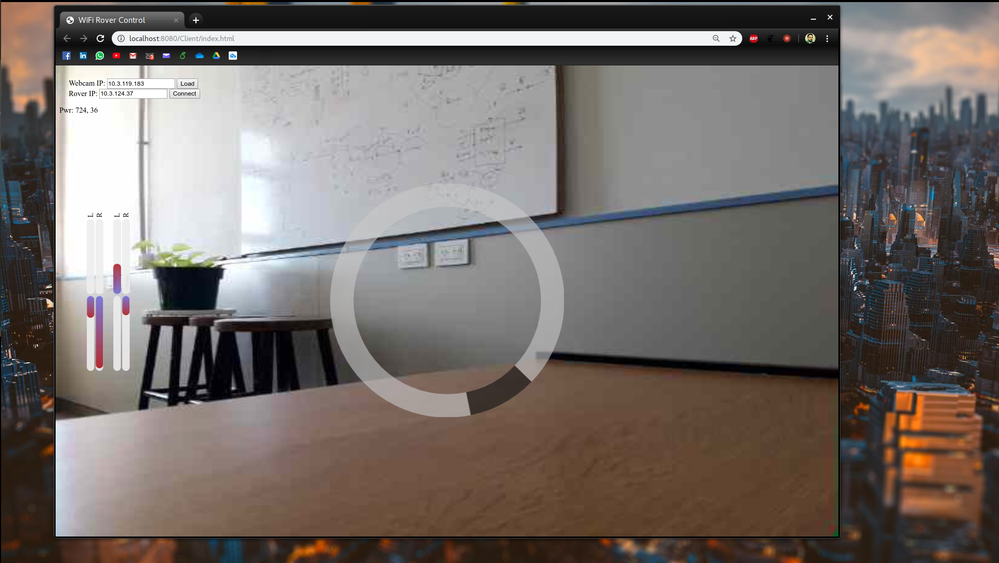
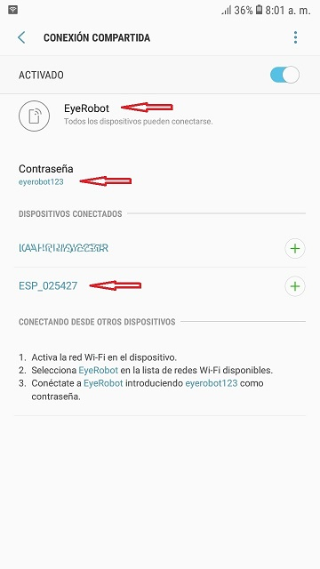
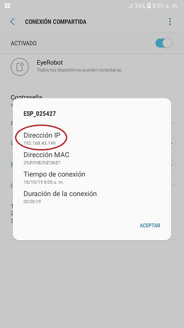

# Control de robot FPV Wi-Fi con Eyetracker Tobii

## Esquema general
  

## Robot
  

## Video captura del control con mouse
  

## Requerimientos recomendados

  - NodeMCU Amica v3.  
  - L298n Dual Full-Bridge.  
  - Kit Chasis Robot 3 Ruedas.  
  - Tobii Eyetracker.  
  - Android Smartphone con app de cámara IP. Por ejemplo:  
  https://play.google.com/store/apps/details?id=com.pas.webcam&hl=es_AR 
  - Navegador web Chrome.  

## Instrucciones de uso

  1. Configurar el smartphone como hotspot usando "EyeRobot" como nombre de red (SSID) y "eyerobot123" como password:  
  
  2. Encender el Rover.  
  3. Verificar en el smarphone que el rover se haya conectado a la red correctamente y anotar el número de IP del dispositivo:  
  
  4. Ejecutar la app de cámara IP y anotar la IP de conexión.  
  5. Instalar el smartphone en el rover. Es recomendable usar una aplicación de control remoto para el smartphone, de modo de poder controlarlo desde la PC sin tener que quitarlo del rover.  
  6. Conectar la PC a la red wifi "EyeRobot".  
  7. Ejecutar la web con Chrome, en la PC.  
  8. Ingresar las IPs del rover y de la cámara IP y presionar los botones para establecer la conexión.  

## Tobii EyeX Web Socket Server

El autor del Web Socket Server para el Eyetracker Tobii es Stevche Radevski:  
https://github.com/sradevski/Tobii-EyeX-Web-Socket-Server  

## Licencia

Este proyecto está publicado bajo licencia GPL V3.0.