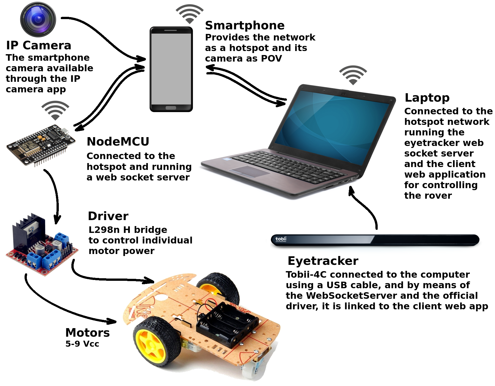

# Eyetracker controlled FPV Wi-Fi rover 

This project consists on a simple three-wheeled rover built on the [chassis kit](https://www.amazon.com/perseids-Chassis-Encoder-Wheels-Battery/dp/B07DNYQ3PX/ref=sr_1_5?dchild=1&keywords=arduino+rover+robot&qid=1630333979&sr=8-5) that you can control using a [Tobii Eyetracker](https://www.amazon.com/-/es/Tobii-Eye-Tracker-herramienta-seguimiento/dp/B01MAWPMXQ).  

Basically, through a web based client application that you can run in your browser, you get a HUD on your screen with the rover's point of view, and by moving your gaze over the HUD, you send the control action to the rover via web socket commands.

If you replace the rover with a wheelchair and mount the computer and IP camera on the same wheelchair, then you'd be able to control it with your gaze. Of course a lot of safety rules and fine tunning is required to achieve this, but this project provide the basic hardware to begin with.

## System main components
  

## The assembled rover
  

## Screen capture of the client application (controlled with mouse)
  

## Recommended requirements

  - NodeMCU Amica v3.  
  - L298n Dual Full-Bridge.  
  - Kit 3 wheeled robot.  
  - Tobii Eyetracker.  
  - Android Smartphone with IP camera app. For example:  
  https://play.google.com/store/apps/details?id=com.pas.webcam&hl=en  
  - Chrome web browser.  

## Getting started

  1. Configure the smartphone as hotspot using "EyeRobot" as SSID and "eyerobot123" as password:  
  
  2. Turn on the rover.  
  3. Using the smartphone, verify that the rover has successfully conected and write down the IP address of the device:  
  
  4. Run the IP camera app and write down the connection IP.  
  5. Attach the smartphone to the rover. It is also recommended a remote control app for the smartphone, so you can use it from the computer without removing it from the rover.  
  6. Connect your personal computer to the "EyeRobot" wifi network.  
  7. Run the client with the Chrome browser, in your PC.  
  8. Put the corresponding IP addresses of the rover and the IP camera and push the "connect" buttons to stablish the websocket conection.  
  9. That's it. Have fun!  

## Tobii EyeX Web Socket Server

The author of the Eyetracker Tobii Web Socket Server is Stevche Radevski:  
https://github.com/sradevski/Tobii-EyeX-Web-Socket-Server  

## License

This project is published under the GPL V3.0 license.